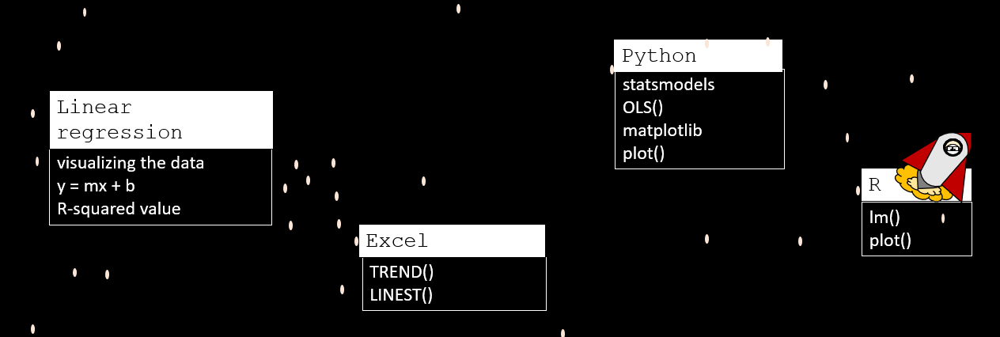
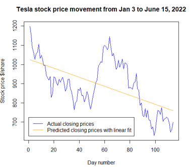
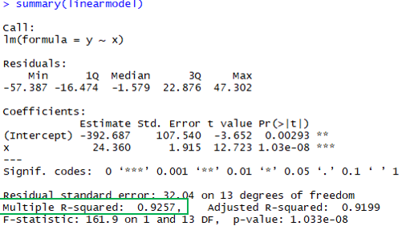
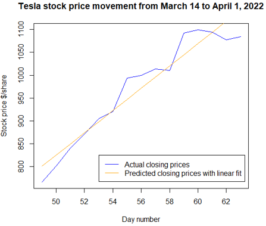

# LinearRegression_R


[Hello, World!](https://www.youtube.com/watch?v=MrEkwt-wZ5w) I am the DataByte. This repo hosts my scripts (R) that I walk through in my linear regression series on YouTube. 

Check out (my first video) to hear more about these topics:



# Mathematics

In my YouTube video, I give a short mathematical explanation of linear regression trendlines are calculated.

## R-squared value 

The R-squared value (the coefficient of determination) helps you determine if your data is exhibiting linear behavior or not. R-squared values range between 0 and 1, with 1 indicating a perfect linear trend. Values beteween 0.7 and 1 indicate that your data has a linear trend. You probably don't want to be using any linear trendlines with R-squared values less than 0.7 to make predictions. 

# Code

Linear regression in R is easy using the `lm()` function.

```
linearmodel <- lm(y ~ x)
```

Calling `summary()` will give you a description of your model. 
 
Linear regression can help you capture the general trend of your data, but if the R-squared values is less than 0.7, it's not going to be very much good for making predictions.

 

Sometimes, you may be able to find a subset in your dataset that may still exhibit strongly linear characteristics, like Tesla stock's closing prices between March 14th and April 1st, 2022. It's an interesting observation, but if you told anyone you were trading off a linear model, they'd probably think you were crazy! 



 

# Dependencies

None

# References

It is easy to find sources online to learn more about linear regression, here are some great references. 

[lm: Fitting Linear Models](https://www.rdocumentation.org/packages/stats/versions/3.6.2/topics/lm)

# More?
If you want to hear more from me, check out my [Hello, World!](https://www.youtube.com/watch?v=MrEkwt-wZ5w) video on YouTube and subscribe! I'm constantly working on new content :) 
